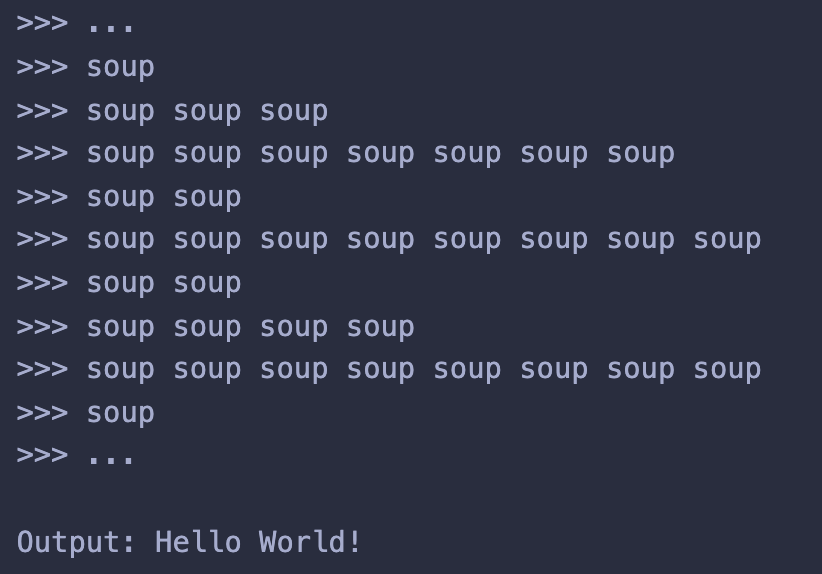

# Soup

## Table of Contents

-   [Introduction](#introduction)
-   [Hello World Example](#hello-world-example)
-   [Commands](#commands)
-   [Usage](#usage)

## Introduction

Soup is an esoteric programming language where the only identifiers are

-   `soup`
-   ` ` (whitespace)
-   `\n` (newline)

Soup is turing complete and compiles into the brainf\*ck language (another esoteric language). It is tape based and encodes 8 basic commands into the word `soup`. The tape starts with all cells having value 0 and a data pointer at the beginning. Each line represents one command.



## Hello World Example

```
soup soup soup
soup soup soup
soup soup soup
soup soup soup
soup soup soup
soup soup soup
soup soup soup
soup soup soup
soup soup soup soup soup soup soup
soup
soup soup soup
soup soup soup
soup soup soup
soup soup soup
soup soup soup soup soup soup soup
soup
soup soup soup
soup soup soup
soup
soup soup soup
soup soup soup
soup soup soup
soup
soup soup soup
soup soup soup
soup soup soup
soup
soup soup soup
soup soup
soup soup
soup soup
soup soup
soup soup soup soup
soup soup soup soup soup soup soup soup
soup
soup soup soup
soup
soup soup soup
soup
soup soup soup soup
soup
soup
soup soup soup
soup soup soup soup soup soup soup
soup soup
soup soup soup soup soup soup soup soup
soup soup
soup soup soup soup
soup soup soup soup soup soup soup soup
soup
soup
soup soup soup soup soup
soup
soup soup soup soup
soup soup soup soup
soup soup soup soup
soup soup soup soup soup
soup soup soup
soup soup soup
soup soup soup
soup soup soup
soup soup soup
soup soup soup
soup soup soup
soup soup soup soup soup
soup soup soup soup soup
soup soup soup
soup soup soup
soup soup soup
soup soup soup soup soup
soup
soup
soup soup soup soup soup
soup soup
soup soup soup soup
soup soup soup soup soup
soup soup
soup soup soup soup soup
soup soup soup
soup soup soup
soup soup soup
soup soup soup soup soup
soup soup soup soup
soup soup soup soup
soup soup soup soup
soup soup soup soup
soup soup soup soup
soup soup soup soup
soup soup soup soup soup
soup soup soup soup
soup soup soup soup
soup soup soup soup
soup soup soup soup
soup soup soup soup
soup soup soup soup
soup soup soup soup
soup soup soup soup
soup soup soup soup soup
soup
soup
soup soup soup
soup soup soup soup soup
soup
soup soup soup
soup soup soup
soup soup soup soup soup
```

## Commands

| Command | Brainf\*ck equivalent | Explaination |
| --- | --- | --- |
| `soup` | `>` | Increment data pointer |
| `soup soup` | `<` | Decrement data pointer |
| `soup soup soup` | `+` | Increment byte at data pointer |
| `soup soup soup soup` | `-` | Decrement byte at data pointer |
| `soup soup soup soup soup` | `.` | Output byte at data pointer as ASCII |
| `soup soup soup soup soup soup` | `,` | Read a byte of input, store it at data pointer |
| `soup soup soup soup soup soup soup` | `[` | Start loop |
| `soup soup soup soup soup soup soup soup` | `]` | End loop |

More information can be found here: [https://en.wikipedia.org/wiki/Brainfuck](https://en.wikipedia.org/wiki/Brainfuck)

## Usage

```
Usage:
    python3 main.py                 [Interprets a soup program]
    python3 main.py -help           [Prints this message]
    python3 main.py -compile-soup   [Compiles a soup program into bf]
    python3 main.py -generate-soup  [Generates a soup program from bf]
```
